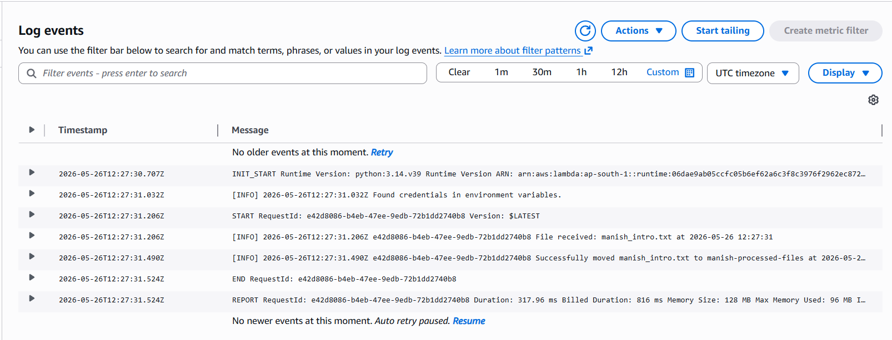

# AWS Lambda File Mover 🚀

A serverless automation pipeline built on AWS that automatically moves files between S3 buckets and logs every action to CloudWatch.

## 🔗 How It Works
1. Upload any file to `manish-incoming-files` S3 bucket
2. Lambda function triggers automatically
3. File gets copied to `manish-processed-files` bucket
4. Filename and timestamp get logged to CloudWatch

## 🛠️ AWS Services Used
- **AWS S3** — Source and destination buckets
- **AWS Lambda** — Serverless function (Python 3.14)
- **AWS CloudWatch** — Logging and monitoring
- **AWS IAM** — Role and permissions

## 📁 Project Structure
aws-lambda-file-mover/
├── lambda_function.py   ← Python code that runs on AWS
├── cloudwatch_screenshot.png
└── README.md

## 📸 CloudWatch Logs Proof

## 💡 What I Learned
- How to create and configure S3 buckets
- How to write and deploy a Lambda function in Python
- How to connect S3 triggers to Lambda
- How to monitor function execution in CloudWatch

## 👤 Author
**Manish Ram Kondoz** — Data Engineer
- GitHub: https://github.com/ManishRamKP
- LinkedIn: https://linkedin.com/in/manishramkondoz
- Email: manishramk@gmail.com
